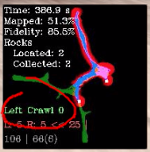
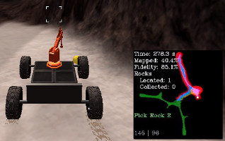
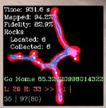
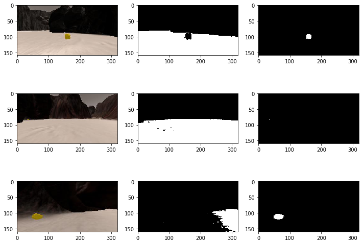

# Writeup: Search and Sample Return Project

 * [Autonomous Navigation and Mapping](#autonomous-navigation-and-mapping)
   + [Decision processing step](#decision-processing-step)
     - [Navigation states](#navigation-states)
     - [Priority issues](#priority-issues)
     - [Layers of decision](#layers-of-decision)
     - [Code for `decision_step()` implementation](#code-for--decision-step----implementation)
     - [Detecting obstacles](#detecting-obstacles)
     - [Avoiding obstacles](#avoiding-obstacles)
     - [Detecting closed corners](#detecting-closed-corners)
   + [Perception processing step](#perception-processing-step)
 * [Results obtained with this implementation](#results-obtained-with-this-implementation)
 * [Notebook Analysis](#notebook-analysis)
   + [Color detection functions](#color-detection-functions)
   + [Image processing applied to navigation sequence](#image-processing-applied-to-navigation-sequence)


## Autonomous Navigation and Mapping
### Decision processing step

#### Navigation states
Three states where defined and used to allow different navigation modes:

 - `NAV_BIAS_LEFT`: This mode is based on the provided navigation rule, which takes the mean of the
   angles of the navigable pixels to get the direction of the car, and adds two important elements
   to the calculations:
   - Adds a constant bias of `+7` degrees, so that the direction will tend more to the left (left
     wall crawler)
   - Each pixel's angle is **ponderated by a factor between `[0-1]`** (`Rover.visited_ponderators`)
     depending on how well visited is each pixel (for details, see
     [`perception_step()`](#perception-processing-step)). Pixels shown with confidence in the
     minimap, will have this value tending to `0`,
     so that they will count only a bit to the mean calculation. Pixels that remain unseen will have
     this value tending to `1`, so that the direction of the car will tend towards them and they
     will more likely become explored.

   In the minimap window, there's a text indicating which is the current state of the vehicle. In
   the image below, it can be read "Left Crawl" with a number next to it, which is a timeout that
   was used to change to other modes that were later removed and not currently used.

   

 - `NAV_TO_ROCK`: as mentioned before, reaching some rocks require the rover to go insistently
   towards a wall, which is an undesired behavior under any other circumstance. Hence, this mode
   avoids decreasing the speed even though there may be an obstacle ahead, if a rock is being
   detected in that direction. It still tries to avoid single-sided obstacles, so that it won't get
   stuck upon a wall when reaching from the side, and instead will try to go around and pick it
   perpendicular to the wall.

   The image below shows the vehicle in that state. The number next to the "Pick Rock" text is just
   a timeout counter to avoid pursuing a rock forever in case we lose sight for long time.

   

 - `NAV_BACK_HOME`: This mode gets activated only after all rocks are picked up and there's been no
   exploration progress since 1 minute ago. It will cause the car to go back to the initial point.
   The image below shows the text shown in this state (the number next to the "Go Home" text is the
   distance to reach the destination.

   


#### Priority issues
The modes listed above are completely masked if the flag `Rover.near_sample` is set. In that case,
the rover will just stop and set the `Rover.send_pickup` flag to move the robotic arm and pick the
rock.

Also, `Rover.seeing_rock` is a priority flag that is activated whenever
a rock pixel is detected in any frame. Because sometimes these pixels tend to flicker or rocks
dissappear from sight, this flag will cause a timeout counter to get restarted
(`Rover.rock_seeking_counter`), and whenever this timeout hasn't expired, the rover will be in
`NAV_TO_ROCK` mode, trying to navigate towards the rock that was just seen. When the rock pixels
dissappear but the rover is still looking for it, it will estimate the direction of steering using
the `Rover.last_seen_rock` angle.

#### Layers of decision
The rover needs to make the final decision of what throttle and steer to set, based on what
I identify as different "Layers" because some of them are long term goals (like exploring the map
preferring the left direction, or going back to the initial position), and other fundamental short
term goal, which is not crashing against obstacles.

Although the mean angle navigation solves some
of these problems, there are cases in which it fails: when obstacles are in the center of the
camera, but there's navigable terrain on both sides. The mean angle of these two groups of
navigable pixels cancel out and the direction ends up pointing to the place where the obstacle is.

To tackle all these issues at the same time, the implementation takes the decisions in steps:
 - First, the desired direction angle is calculated according to the navigation mode.
 - Second, the function `go_towards_direction(preferred_direction)` takes the target direction,
   and calculates the best possible steering angle, taking into account obstacles, to avoid hitting
   them. It also decides the speed at which it's safe to move, depending on how clear is the path
   forward.
 - Third, the function `set_rover_to(target_angle, target_speed)` will throttle or brake the car to
   reach the desired speed, or eventually stop to steer when `target_speed=0`.

In the mode `NAV_TO_ROCK`, this order is not exactly met, since `target_speed` is calculated
directly in the first step, to avoid braking in front of walls when pursuing a rock, as mentioned
before.

#### Code for `decision_step()` implementation
With the general description presented above, the basic logic of the function can be understood.
There are still several details to cover but they will be described after this section.

```python
def decision_step(Rover):
    Rover.debug_txt = ''
    Rover.pos_txt = '{:.0f} | {:.0f}'.format(Rover.pos[0], Rover.pos[1])
    Rover.speed = np.abs(Rover.vel)

    # Only first frame: save initial position to come back after mission ends
    if Rover.initial_pos is None:
        Rover.initial_pos = np.array(Rover.pos)

    # Check mission and emergency unlocking
    if finished_mission(Rover) or unlock_mechanism(Rover):
        return Rover

    # First priority: if we're near sample, brake and pick it up
    if Rover.near_sample:
        Rover.throttle = 0
        Rover.brake = Rover.brake_set
        if Rover.vel == 0:
            if not Rover.picking_up:
                Rover.send_pickup = True
            Rover.rock_seeking_counter = 0
    else:
        # Second priority: seeing rock, go towards it
        if Rover.seeing_rock:
            Rover.nav_mode = Rover.NAV_TO_ROCK
            Rover.rock_seeking_counter = 400
            Rover.last_seen_rock = np.mean(Rover.rock_angles)

        # Third priority: explore map in different modes
        elif not Rover.rock_seeking_counter:
            Rover.nav_mode = select_nav_mode(Rover)

        # Navigate according to the current mode
        target_speed = None
        if Rover.nav_mode == Rover.NAV_TO_ROCK:
            target_angle, target_speed = go_towards_rock(Rover)
            Rover.rock_seeking_counter -= 1
            Rover.mode_txt = "Pick Rock"

        elif Rover.nav_mode == Rover.NAV_BIAS_LEFT:
            target_angle = np.mean(Rover.nav_angles * Rover.visited_ponderators) + 7
            Rover.mode_txt = "Left Crawl"

        elif Rover.nav_mode == Rover.NAV_BACK_HOME:
            target_angle = get_point_direction(Rover, Rover.initial_pos)
            Rover.mode_txt = "Go Home {}".format(Rover.dist_to_orig)

        # We've got a destination, calculate speed if not set by nav_mode
        if target_speed is None:
            target_angle, target_speed = go_towards_direction(Rover, target_angle)

        # Set throttle/brake/steer
        set_rover_to(Rover, target_angle, target_speed)

    return Rover
```

#### Detecting obstacles
One of the core functions that allows detection of obstacles and nearby to walls, is the one that
allows to measure the distance of the nearest object, looking into a given `target_angle`, and with
a certain angle `span`. The implementation relies on `Rover.obs_angles` which is similar to
`Rover.nav_angles` but contains the exact complementary pixels, meaning the obstacle angles.

```python
def get_nearest_object(Rover, target_angle, span=5):
    if not len(Rover.obs_angles):
        return Rover.max_view_distance

    # Obstacles with angles near target_angle
    target_mask = np.abs(Rover.obs_angles - target_angle) < span
    obstacles_ahead = Rover.obs_dists[target_mask]
    if len(obstacles_ahead) < 20:  # avoid false obstacles (e.g: wheel marks)
        return Rover.max_view_distance
    return np.mean(get_n_min_values(obstacles_ahead, 30)) - Rover.min_view_distance
```

The first condition is to avoid doing anything when the terrain ahead doesn't contain any obstacles
(`Rover.obs_angles` will be empty).

Then it creates a mask that selects only those pixels within the angle span provided, that's the
direction it's looking to find obstacles. If there're less than 20 obstacle pixels, it considers
that there's no actual obstacle, but instead some dark noise in the image, like wheel marks.

Finally, it averages the distance of the nearest 30 pixels labeled as obstacles, and takes that as
the distance of the nearest object. This method proved to work quite well in this environment.

#### Avoiding obstacles
Built upon the previous function, the following function will take a `target_angle` and modify it to
avoid collisions with objects.

The basic logic is: see obstacles to the left and to the right. If there's a disbalance in the
distance of nearest objects, within the distance given as `margin`, add an offset to go in the
direction of the farthest object.

If the nearest object in some side is too near (below `margin/2`), forget the
`target_angle`, but otherwise, add an offset to the desired angle to avoid the
obstacle.

```python
def add_obstacle_avoiding_offset(Rover, target_angle, margin=40):
    target_angle = np.clip(target_angle, -15, 15)

    # Short range crash avoid: offset increases with inverse distance to near objects
    nearest_object_left = get_nearest_object(Rover, 20, 20)
    nearest_object_right = get_nearest_object(Rover, -20, 20)
    Rover.debug_txt += "L: {:.0f} R: {:.0f}".format(nearest_object_left, nearest_object_right)
    offset = 0
    if nearest_object_left < margin:
        offset = -3 * ((margin/2) / nearest_object_left) ** 2 # I'm very afraid of rocks!
    if nearest_object_right < margin:
        offset += 3 * ((margin/2) / nearest_object_right) ** 2
    if offset:
        if min(nearest_object_left, nearest_object_right) < margin/2:
            target_angle = offset
        else:
            target_angle += offset
        Rover.debug_txt += " {} {:.0f} | ".format('<<' if offset > 0 else '>>', offset)

    return np.clip(target_angle, -15, 15)
```
Note that the offset is cuadratic with the inverse of the distance, to increase
sensitivity to nearby objects.

#### Detecting closed corners
Another interesting function implemented is the one that detects when there's no navigable terrain
ahead, despite not having hit a wall yet. The implementation is quite simple and proved to work
fine:

```python
# Detect when there's no visible way out
def closed_boundary(Rover):
    return len(Rover.obs_dists) and len(Rover.nav_dists)\
           and np.max(Rover.nav_dists) < (np.max(Rover.obs_dists) * 0.5)
```

The first two conditions are just to ensure that there are both navigable and obstacle pixels.
Then it checks if the farthest navigable pixel is before the middle of the maximum view distance,
and if that's the case, we should turn around and go our way back. The `0.5` margin is quite
arbitrary of course, but using higher values can be risky since we might turn around before being
sure that there's no way out.

### Perception processing step

Only `perception_step` code is included here, not the helper functions and classes (like `RoverCam`) which
can be seen in the same source code file `perception.py`.

The main features to note in the following `perception_step()` function are:
 - The `RoverCam` class, which contains some static information about the camera, to avoid
   recalculating it in each frame. Members of this class are:
    - `perspect_M`: perspective transform matrix used by OpenCV (only calculated once)
    - `view_mask`: allows filtering the rover `vision_image` to certain distance range, in which the
      image is considered valid. Out of that range, image is not considered to make decisions about
      navigation. The only exception is for the rocks channel, since we want to see rocks from as
      far away as possible.
 - `worldmap` only gets updated if `pitch` and `roll` are below certain value
 - The `vision_image` for navigation angles is showing `visited_ponderators` which is similar to
   a mask but the value in each point is a fuzzy value in range `[0-1]`, where most visited places
   (pixels already present in the minimap with high values) tend to 0.
   This is used in `decision.py` to ponderate the `nav_angles`, so that the resulting mean angle
   tends to prefer not visited places.
 - The pixels added to the minimap are even more restricted in distance range, using the
   `sure_mask`. This is obviously to improve fidelity.

```python
def perception_step(Rover):
    # Set camera size (will update transform params only on change)
    RoverCam.set_img_shape(Rover.img.shape[0], Rover.img.shape[1])

    # Warp camera to map-view
    warped = perspect_transform(Rover.img, RoverCam.perspective_M)

    # Apply thresholds to detect navigable map and rocks first
    nav_thres = color_thresh(warped, rgb_thresh=(180, 160, 150)) * RoverCam.view_mask
    rock_range = color_range(warped, rgb_range=((130, 250), (90, 200), (0, 40)))
    obstacles = np.abs(1 - nav_thres) * RoverCam.view_mask  # opossite to navigable terrain

    # Calculate navigable pixel values in rover-centric coords
    xpix_rov, ypix_rov = rover_coords(nav_thres)
    xpix_obs_rov, ypix_obs_rov = rover_coords(obstacles)
    xpix_rock_rov, ypix_rock_rov = rover_coords(rock_range)

    # Make sure we have some navigable terrain to process
    if len(xpix_rov) > 1:

        # Navigable pixels distances and angles
        dist, angles = to_polar_coords(xpix_rov, ypix_rov)
        Rover.nav_dists = dist
        Rover.nav_angles = angles

        # Calculate pitch and roll deviations (avoid jump from 0-360)
        roll_err = np.abs(Rover.roll if Rover.roll < 180 else Rover.roll - 360)
        pitch_err = np.abs(Rover.pitch if Rover.pitch < 180 else Rover.pitch - 360)

        # world map is 1pix = 1m, our perspect_transform() produces 10pix = 1m
        scale = 10
        # Convert from rover-centric to worldmap coords
        xpix_nav, ypix_nav = pix_to_world(xpix_rov, ypix_rov,
                                          Rover.pos[0], Rover.pos[1],
                                          Rover.yaw,
                                          Rover.worldmap.shape[0],
                                          scale)

        # Visited places have lesser values [0, 1], this is used to ponderate mean angle
        Rover.visited_ponderators = (260 - Rover.worldmap[ypix_nav, xpix_nav, 2]) / 260

        # only add points to worldmap when we've small pitch and roll
        if roll_err < 1.5 and pitch_err < 2.0:

            # how new is this terrain being explored? low pass filter (iir moving avg)
            Rover.visit_gain = (Rover.visit_gain * 199 + np.mean(Rover.visited_ponderators)) / 200

            # Update minimap only for nearby pixels
            sure_mask = dist < 30
            ypix_nav_sure = ypix_nav[sure_mask]
            xpix_nav_sure = xpix_nav[sure_mask]
            Rover.worldmap[ypix_nav_sure, xpix_nav_sure, 2] += 10

            # Repeat the transformation to show obstacles on the map
            xpix_obs, ypix_obs = pix_to_world(xpix_obs_rov, ypix_obs_rov,
                                                Rover.pos[0], Rover.pos[1],
                                                Rover.yaw,
                                                Rover.worldmap.shape[0],
                                                scale)
            Rover.worldmap[ypix_obs, xpix_obs, 0] += 1
            # Remove objects from any navigable zones
            Rover.worldmap[Rover.worldmap[:, :, 2].nonzero(), 0] = 0

            # Repeat the procedure to show rocks on the map
            xpix_rock, ypix_rock = pix_to_world(xpix_rock_rov, ypix_rock_rov,
                                                Rover.pos[0], Rover.pos[1],
                                                Rover.yaw,
                                                Rover.worldmap.shape[0],
                                                scale)
            Rover.worldmap[ypix_rock, xpix_rock, 1] += 1

            # Clip all channels to [0-255]
            Rover.worldmap = np.clip(Rover.worldmap, 0, 255)

        Rover.vision_image[:,:,0] = 255 * obstacles
        # Rover.vision_image[:,:,2] = 255*nav_thres
        Rover.vision_image[:,:,1] = 255 * rock_range

        # Show the ponderators in the image (dark zones are already visited)
        ypix_img, xpix_img = nav_thres.nonzero()
        Rover.vision_image[ypix_img, xpix_img, 2] = 255 * Rover.visited_ponderators

    if len(xpix_obs_rov):
        dist, angles = to_polar_coords(xpix_obs_rov, ypix_obs_rov)
        Rover.obs_dists = dist
        Rover.obs_angles = angles

    if len(xpix_rock_rov):
        Rover.seeing_rock = True  # shortcut
        dist, angles = to_polar_coords(xpix_rock_rov, ypix_rock_rov)
        Rover.rock_dists = dist
        Rover.rock_angles = angles
    else:
        Rover.seeing_rock = False
        
    return Rover
```

## Results obtained with this implementation
This implementation is the result of many iterations, and many of the things that were tried are not
included in the code now. So the final solution is quite stable and with different efficience in
time, most of the times it collects all the rocks, explores most parts of the map (near `90%`), and
goes back to the initial point. There are of course many things to improve and implement yet, and
some issues that appear once in a while.

[Recording of one example successful run](https://youtu.be/E-WrL4jrnQA).

**Note:***the explored pixels turn from blue to black in the top view of the processed camera image,
that is because they are being multiplied by the `visited_ponderators`, which tend to zero when the
terrain is already explored (those are used to orient the direction of the car towards unexplored
areas.)*

Some of the main issues that were found during development, and that most of the work was done to
tackle them, were:

 - **The car sometimes hit obstacle rocks that are not visible from its camera but still block its way:** this
   problem was tackled with the implementation of the function `unlock_mechanism()`, which has
   a timeout to detect when the speed is almost null and the car is not steering or picking up
   a rock. The car will apply a throttle backwards and try to steer until it detects that it moved
   from the original locked position.

   The problem of hitting rocks that are not visible at the moment of collision, could be avoided by
   using the obstacles map in the decision process, having something like a path planning
   algorithm or at least have the minimap into account when applying the rudimentary offsets
   mechanism.

 - **Unexplored areas and inefficient exploration:** Another problem that remains to some extent, is that
   the map doesn't get `100%` when the rocks are all collected before that happens (which is usual).
   That is a difficult problem to avoid, but gets worse because the steering direction of the car is
   probabilistic. In the file `decision.py`, the following lines can be found:

   ```python
   Rover.steering_dir = get_steering_to(Rover, Rover.last_nav_yaw)\
                        * np.random.choice(4 * [1] + [-1])
   ```

   This causes that is that `1/5` of the times, the steering will cause the car to go in the
   opposite direction with respect to what it had before starting steering. The reason behind this
   approach, is to avoid deterministic lockings between some tricky pair of corners, where the car
   would get stuck forever going from one corner to the other, because it always steers in the same
   direction and hits the other corner.

   But this has an impact in the exploration efficiency, because sometimes the car finds a rock in
   the middle of the way, and then steers and goes back its way, instead of continuing exploring to
   the end of the way. Also breaks the logic that going
   always following left walls it will go around the entire map, but eventually the car will come
   back to this place.

   This would be relatively easy to improve, by steering the whole circle and then decide which
   direction has a better exploration gain, by using the `visited_ponderators` for example. These
   ponderators add some variability to the decision, avoiding most likely the deterministic lock.
   
   The exploration of regions that are not near walls, is also a problem when a left wall crawler is
   implemented. But in this case, the `visited_ponderators` added to the mean angle calculation,
   solve the problem with great efficiency.

   Another thing that could be implemented, is a navigation based in *points of interest*, being
   those the coordinates of points in the map that must be visited so that the map is entirely
   explored, like corners and also rocks (I discovered that the rock coordinates are all visible in
   the program). The map is always the same, so that approach is feasible and I tried implementing it
   but found some roadblocks and decided to remove it, also because I wasn't sure that it was
   a "legal" solution.

 - **Approaching rocks is sometimes unnecessarily slow:** Because walls are most of the time stick
   to walls, approaching them can be very tricky in some cases. If you try the game in "Training
   mode" you'll see that sometimes the car locks in places that are not apparent obstacles. Due to
   this, the rock approaching mechanism is quite different from the general navigation rule, and
   is designed to approach rocks the more perpendicular to walls as possible. Sometimes it isn't
   necessary, but in general its more robust.

 - **Further tweaking of parameters and improvement of the algorithms**: the mechanisms used to
   avoid obstacles are very sensitive to changes in parameter values. The compromise here is to
   avoid crashing, but at the same time, go through narrow passages to reach all places in the map.
   I spent a lot of time testing and adjusting those parameters, and trying different equations to the
   offset that is added to the steer angle in order to avoid obstacles, which ended up being
   proportional to the inverse of the distance squared, as can be seen in the
   `add_obstacle_avoiding_offset()` function mentioned above.

   And there are many more decisions and parameters that need to be optimized and tested, so that's
   an always open path for improvement (or bugs).

## Notebook Analysis
### Color detection functions

These are the functions that used to identify navigable terrain and rocks.
For navigable terrain the function `color_thresh()` was used as developed during the course.
For rock selection, I defined a new function `color_range()` that allows lower and upper thresholds
for each RGB channel.

```python
# Select pixels whose RGB values are below each corresponding threshold (used for navigable terrain)
def color_thresh(img, rgb_thresh=(180, 160, 150)):
    # Create an array of zeros same xy size as img, but single channel
    color_select = np.zeros_like(img[:,:,0])
    # Require that each pixel be above all three threshold values in RGB
    # above_thresh will now contain a boolean array with "True"
    # where threshold was met
    above_thresh = (img[:,:,0] > rgb_thresh[0]) \
                & (img[:,:,1] > rgb_thresh[1]) \
                & (img[:,:,2] > rgb_thresh[2])
    # Index the array of zeros with the boolean array and set to 1
    color_select[above_thresh] = 1
    # Return the binary image
    return color_select


# Pick colors which RGB values are all between their given ranges (used for rocks)
def color_range(img, rgb_range=((150, 170), (150, 170), (150, 170))):
    # Create an array of zeros same xy size as img, but single channel
    color_select = np.zeros_like(img[:,:,0])
    
    in_range = (img[:,:,0] >= rgb_range[0][0]) & (img[:,:,0] <= rgb_range[0][1])\
               & (img[:,:,1] >= rgb_range[1][0]) & (img[:,:,1] <= rgb_range[1][1])\
               & (img[:,:,2] >= rgb_range[2][0]) & (img[:,:,2] <= rgb_range[2][1])
    # Index the array of zeros with the boolean array and set to 1
    color_select[in_range] = 1
    # Return the binary image
    return color_select
```

In the image below it can be seen these functions in action for various sample images.
Note that the rock is detected even when it's very far away, although only one pixel passes through
the filter.

Also note that next to the rock, the terrain is not identified as navigable. When approaching rocks,
the navigation mode changes to allow going towards a rock even if it's isolated by non-navigable
terrain. This change of mode was necessary because otherwise the car would hit walls when no rocks
were near, or it would never reach rocks that sometimes are located in very tricky places.



### Image processing applied to navigation sequence 

Here is the version of `process_image()` used in the notebook. The version used in `perception.py`
has some further selection to avoid mapping terrain when the pitch and roll angles are not adequate
and such.

```python
def rover_cam_to_map_view_coords(dst_img):
    # Get source and destination squares to transform image from rover camera
    # perspective, to a map view perspective.
    dst_size = 5
    bottom_offset = 6
    source = np.float32([[14, 140], [301 ,140],[200, 96], [118, 96]])
    destination = np.float32([
            [dst_img.shape[1]/2 - dst_size, dst_img.shape[0] - bottom_offset],
            [dst_img.shape[1]/2 + dst_size, dst_img.shape[0] - bottom_offset],
            [dst_img.shape[1]/2 + dst_size, dst_img.shape[0] - 2*dst_size - bottom_offset],
            [dst_img.shape[1]/2 - dst_size, dst_img.shape[0] - 2*dst_size - bottom_offset],
            ])
    return source, destination

def process_image(img):
    # From each img, generate a mosaic with 3 sub-images:
    #  - copy of input img
    #  - warped img converted from rover-POV to map-view
    #  - ground truth map overlayed with navigable map and yellow rocks found

        # Warp camera to map-view
    source, destination = rover_cam_to_map_view_coords(img)
    warped = perspect_transform(img, source, destination)
        # Apply thresholds to detect navigable map and rocks first
    nav_thres = color_thresh(warped, rgb_thresh=(180, 160, 150))
    rock_range = color_range(warped, rgb_range=((130, 250), (90, 200), (0, 40)))

        # Calculate navigable pixel values in rover-centric coords
    xpix_nav, ypix_nav = rover_coords(nav_thres)
        # world map is 1pix = 1m, our perspect_transform() produces 10pix = 1m
    scale = 10
        # Convert from rover-centric to worldmap coords
    xpix_nav, ypix_nav = pix_to_world(xpix_nav, ypix_nav,
                                      data.xpos[data.count], data.ypos[data.count],
                                      data.yaw[data.count],
                                      data.worldmap.shape[0],
                                      scale)
    data.worldmap[ypix_nav, xpix_nav, :] = 50  # paint grey

        # Repeat the procedure to show rocks on the map
    xpix_rock, ypix_rock = rover_coords(rock_range)
    xpix_rock, ypix_rock = pix_to_world(xpix_rock, ypix_rock,
                                        data.xpos[data.count], data.ypos[data.count],
                                        data.yaw[data.count],
                                        data.worldmap.shape[0],
                                        scale)
    data.worldmap[ypix_rock, xpix_rock] = (255, 0, 0)  # paint red

        # First create a blank image (can be whatever shape you like)
    output_image = np.zeros((img.shape[0] + data.worldmap.shape[0], img.shape[1]*2, 3))
    
        # Top left image: original
    output_image[0:img.shape[0], 0:img.shape[1]] = img
    
        # Top right image: Overlay warped with detected thresholds and rocks
    # warped_percept = np.zeros_like(warped)
    # warped_percept[nav_thres] = (0, 255, 255)
    # warped_percept[rock_range] = (255, 0, 0)
    # warped = cv2.addWeighted(warped, 1, warped_percept, 1, 0)  # comment this line to avoid overlay
    output_image[0:img.shape[0], img.shape[1]:] = warped

        # Bottom left: Overlay worldmap with ground truth map
    map_add = cv2.addWeighted(data.worldmap, 1, data.ground_truth, 0.2, 0)
        # Flip map overlay so y-axis points upward and add to output_image 
    output_image[img.shape[0]:, 0:map_add.shape[1]] = np.flipud(map_add)
    
        # Bottom right: Unused for now

    data.count += 1 # Keep track of the index in the Databucket()
    
    return output_image
```

The video created after applying this processing to the given sequence of images, is in [this
file](../output/test_mapping.mp4)


